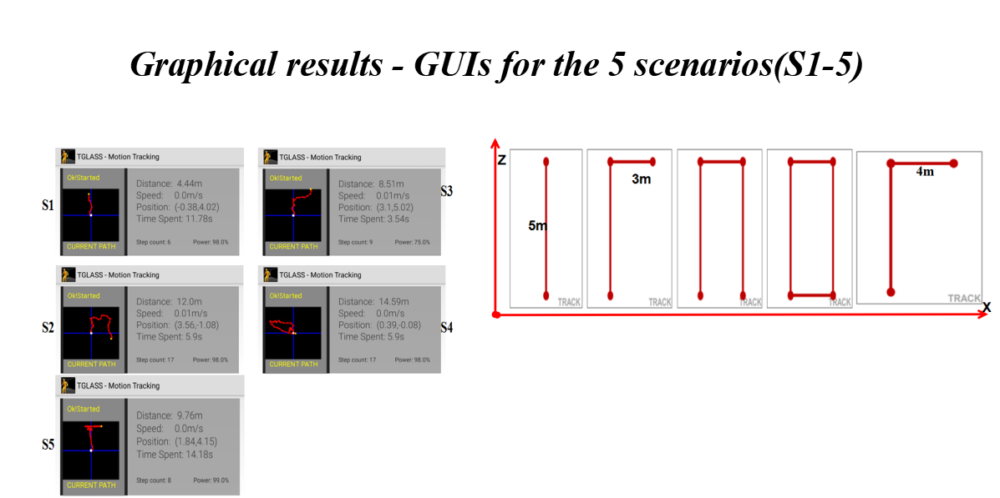

# TGLASS
Human Motion Tracking On Smartglasses Using Built-in Sensors

Abstract—Global Positioning Systems(GPS) have been critical in human motion tracking. However, their inaccessibility in
indoor-environments(buildings, undersea locations...) makes them sometimes useless. Alternatively, external references(maps,
cameras, wireless access points, laser sensors, known sensor locations...) in parallel with machine learning algorithms(artificial
neuronal networks, kalman and particles filters...) are used most of the time. Unfortunately, such solutions cannot
be supported on slow-computing and low-power-battery devices such as smart glasses and less in real-time. In this paper, we present
a smartglassware based on a generic, standalone and robust dead-reckoning approach for pedestrian navigation tracking. Our
high-parameterized approach intuitively reconstructs the pedestrian acceleration based on linear acceleration and rotation vector
sensor data; then integrates it numerically. As services, the system computes in real-time the pedestrian trajectory, distance walked,
number of steps done, position, speed and time spent at a position. We carried out about 150 tests on 8 different scenarios with a
Google glass and the results showed that our system is real-time, accurately detects directional changes, is robust to undesired head
gestures and reaches a normalized root mean square error of 0.2 for the step feature and 0.46 for the distance. Since learning of
parameters was typically done manually, it has been thought that a systemization of those parameters and an automatic learning of
parameters through an optimization algorithm could significantly improve the system performance

# Google Glass

# TGlASS's Architecture

# Results

